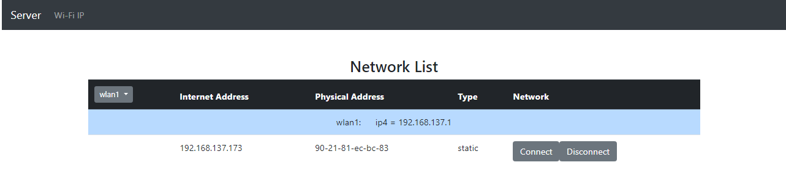

# Server Wi-Fi Network

Control systems versions: Maven;

Framework: SpringBoot;

WEB: Freemarker, HTML, Bootstrap;

<hr>

The program of inclusion and shutdown of the Internet at the IP address of the device connected to the wifi.

<hr>

API

```
GET /
   Response:
         list network connect all
```
```
GET /?data=url

   Request:
      param name=<name network>
      
   Response:
      list of network connections by specific name 
```

```
Post /

  Body: 
      status= 0 & 1

   Response: ?status=0
      connect network ip
      
  Response: ?status=1
        disconnect network ip  
```

<hr>



